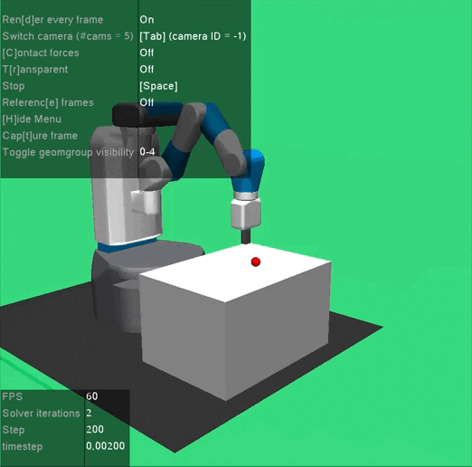

# RL_project-Hindsight-Goal-Ranking-for-Pick-and-Place-tasks

## Abstract
The goal of this project is to implement and evaluate a reinforcement learning
(RL) approach using Hindsight Goal Ranking (HGR) in the context of sparse
reward environments. The approach will be applied to a fixed-base manipulator
performing a pick-and-place operation in simulation. The experiments will be
conducted using the OpenAI Gym Fetch environment.

## FetchReach

The task in Gym FetchReach is for the agent to move the robot's end-effector to a specified target position in space. 

  

## FetchPickAndPlace

In Gym FetchPickAndPlace, the agent must not only reach a target position but also manipulate an object to a desired location.

  

Not highly effective due to limited training time, as the model was trained for only 3300 epochs!

# Dependancies 

- In this project the package `gymnasium-robotics` is required.   
Be careful on the installation because the download via PyPI with `pip install gymnasium-robotics` present a bug in which the base of the manipulator has an offset resulting in some goal reach configuarations to be outside from the workspace.  
I managed this issue by installing the package directly from GitHub via:  
  `git clone https://github.com/Farama-Foundation/Gymnasium-Robotics.git
cd Gymnasium-Robotics`  
  `pip install -e .`

- Install the requirements:  
  `pip install requirements.txt`

- Mujoco engine is required check the installation procedure in the official site: [https://robotics.farama.org/content/installation/](https://robotics.farama.org/content/installation/)
